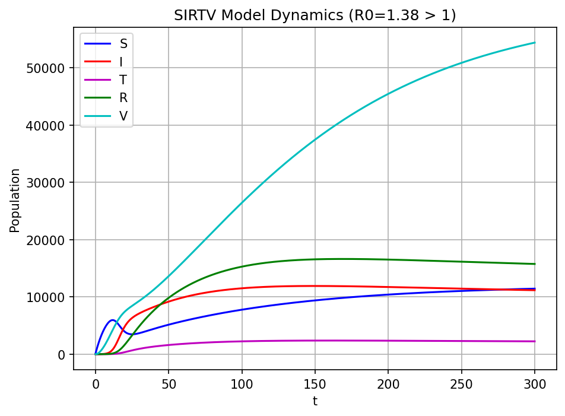

# Influenza Transmission Modeling (SIRTV)

A 5-compartment epidemic model (**S**usceptible–**I**nfected–**T**reated–
**R**ecovered–**V**accinated) that quantifies how vaccination, treatment,
social distancing, and waning immunity each affect the size and course of
an influenza outbreak. Includes a closed-form stability analysis, a PRCC
sensitivity analysis of R0, and an interactive dashboard.

**Key finding:** vaccination rate has the strongest effect on R0 of any
single intervention modeled — more effective than social distancing,
treatment, or natural recovery.

[**Try the live dashboard →**](#) *(add your Streamlit Cloud link here after deploying)*



## What this project does

- Derives the model's disease-free and endemic equilibria, R0, and local
  stability conditions analytically
- Validates the analytical results numerically (equilibrium convergence,
  threshold behavior at R0 = 1, Jacobian eigenvalue checks)
- Runs a PRCC (Partial Rank Correlation Coefficient) sensitivity analysis
  to rank which parameters matter most for R0
- Ships an interactive dashboard so you can explore "what if we vaccinate
  more / social-distance more" scenarios live, not just read static plots

## Quickstart

```bash
git clone <your-repo-url>
cd influenza-sirtv-model
pip install -r requirements.txt

# Run the test suite
pytest tests/ -v

# Generate all four figures into figures/
python -m src.sirtv.plots

# Launch the interactive dashboard
streamlit run dashboard/app.py
```

## Repository structure

```
influenza-sirtv-model/
├── src/sirtv/
│   ├── model.py         # ODE right-hand side + integration
│   ├── equilibria.py    # DFE, R0, Jacobian, stability
│   ├── sensitivity.py   # PRCC sensitivity analysis
│   ├── config.py        # Baseline parameter sets
│   └── plots.py         # Static figure generation
├── dashboard/app.py      # Interactive Streamlit dashboard
├── tests/                # pytest suite (9 tests)
├── figures/              # Generated PNG figures
└── .github/workflows/    # CI: tests run automatically on every push
```

## The model

```
S' = λ − β(1−σ)SI/N − νS + ω_R·R + ω_V·V − μS
I' = β(1−σ)SI/N − (γ + τ + μ)I
T' = τI − (γ_T + μ)T
R' = γI + γ_T·T − (ω_R + μ)R
V' = νS − (ω_V + μ)V
```

with basic reproduction number

```
R0 = β(1−σ)(S0/N0) / (γ + τ + μ)
```

The disease-free equilibrium is locally stable when R0 < 1 and unstable
when R0 > 1; an endemic equilibrium exists and is stable when R0 > 1.

## From MATLAB prototype to a validated Python project

This started as a MATLAB script written for a math modeling course. Porting
it to Python and writing a test suite surfaced two correctness bugs in the
original code, and one significant parameter-realism issue:

1. **Hardcoded population size.** The MATLAB `model()` function hardcoded
   `N = 1000` inside the infection term, even though the model's own
   population dynamics (`N' = λ − μN`, derived in the analysis) mean N
   converges to λ/μ, not a fixed constant. This silently broke the
   frequency-dependent transmission term whenever λ/μ ≠ 1000. Fixed by
   computing N dynamically as S+I+T+R+V everywhere, matching the
   analytical Jacobian.

2. **Inconsistent R0 formulas.** The MATLAB script computed the
   disease-free equilibrium S0 one way in the main script
   (`S0 = λ/(ν+μ)`, missing a term and not solving the true steady-state
   system), and then used a *third*, further-simplified R0 approximation
   in the sensitivity analysis section (`λ/(ν+μ)` substituted directly for
   S0). All three didn't agree. Fixed by deriving the closed-form DFE once
   and reusing it consistently everywhere R0 is computed.

3. **Unrealistic transmission rate.** The script's `beta = 0.005` is
   roughly three orders of magnitude below the "realistic range" the
   model's own parameter table specifies (0.2–1.5). Combined with bug #2,
   this meant the script's R0 > 1 "outbreak" figure didn't actually
   correspond to an outbreak once the equilibrium formula was corrected.
   The baseline parameters here use a beta value from within the stated
   realistic range that does produce R0 > 1.

See inline comments in `equilibria.py`, `model.py`, and `sensitivity.py`
for the full technical explanation of each fix, and `tests/` for the
regression tests that catch them.

## Limitations

The model assumes homogeneous mixing (everyone contacts everyone at the
same rate), which doesn't capture real-world contact-network structure.
Extensions worth exploring: age structure, spatial heterogeneity,
stochastic effects, and parameter estimation against real surveillance
data.

## References

Brauer, van den Driessche & Wu (2008), *Mathematical Epidemiology*, Springer.
Keeling & Rohani (2019), *Modeling Infectious Diseases in Humans and Animals*, Princeton.
Abdoon et al. (2023), *Alexandria Engineering Journal*.
van den Driessche & Watmough (2008), in *Mathematical Epidemiology*, Springer.
